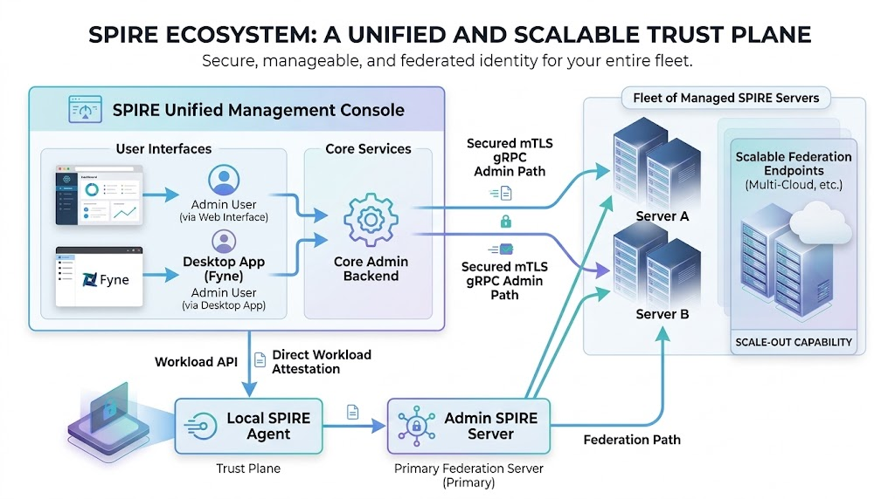
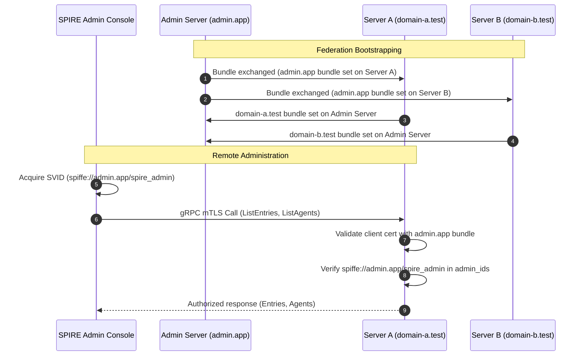

# 🏛️ SPIRE Admin Console - Architecture & Design Document

## 1. Executive Summary & Goals

The **SPIRE Admin Console** is a unified, enterprise-grade administrative platform designed to manage and monitor [SPIRE](https://github.com/spiffe/spire) (SPIFFE Runtime Environment) deployments across distributed zero-trust infrastructures. 

The platform is available in two form factors:
- **Desktop GUI**: A native cross-platform desktop application built with Go and the [Fyne](https://fyne.io/) v2 GUI toolkit.
- **Web Console**: A secure Single-Page Application (SPA) powered by a Go/[Gin](https://gin-gonic.com/) REST backend and served over HTTPS.

### Key Objectives
- **Zero-Trust Administrative Access**: Administer remote SPIRE servers without static API tokens, long-lived master passwords, or insecure network channels, relying exclusively on dynamic SPIFFE identities (X.509 SVIDs) over mutual TLS (mTLS).
- **Multi-Domain Control Plane**: Centralize visibility and control over multiple independent SPIFFE trust domains (`admin.app`, `domain-a.test`, `domain-b.test`, etc.).
- **Full Lifecycle Management**: Provide complete CRUD capabilities for registration entries, agent lifecycle (attestation, eviction, banning, expired agent purging), trust bundle distribution, dynamic federation relationships, and signing authority rotation/tainting/revocation.
- **Role-Based Access Control (RBAC)**: Enforce administrative separation of privileges between administrators and operators within the web console.

---

## 2. System Architecture & Topology

The SPIRE Admin Console is itself architected as a **SPIFFE Workload**. Instead of possessing hardcoded administrative credentials, it interfaces with a local SPIRE Agent via the SPIFFE Workload API to dynamically retrieve short-lived X.509 SVID certificates and private keys.




---

## 3. Security & Identity Architecture

### 3.1 Workload Attestation & SVID Acquisition
1. The admin application starts and connects to the SPIRE Agent's Unix Domain Socket (`agent.sock`).
2. The SPIRE Agent uses the `unix` Workload Attestor plugin to inspect the process UID (`unix:uid:$(id -u)`).
3. Upon verifying the process selector, the Agent returns an X.509 SVID whose SPIFFE ID matches:
   ```
   spiffe://admin.app/spire_admin
   ```
4. The Go application uses `github.com/spiffe/go-spiffe/v2/workloadapi` (`X509Source`) to maintain the X.509 SVID in memory, automatically rotating certificates prior to expiration without process restarts.

### 3.2 Mutual TLS (mTLS) gRPC Transport
When establishing connections to remote SPIRE servers:
- The `servers.SpireServer` client utilizes `grpccredentials.MTLSClientCredentials(source, source, tlsconfig.AuthorizeAny())`.
- During the TLS handshake, the SPIRE Admin Console presents its X.509 SVID to the remote SPIRE Server.
- The remote SPIRE Server validates that the certificate chains up to the trusted bundle of `admin.app`.

### 3.3 Remote Server Authorization (`admin_ids`)
The target SPIRE Server enforces authorization via its HCL configuration:
```hcl
server {
    bind_address = "127.0.0.1"
    bind_port = 8082
    trust_domain = "domain-a.test"
    admin_ids = ["spiffe://admin.app/spire_admin"]
    # ...
}
```
Any gRPC call to privileged SPIRE APIs (`/spire.api.server.agent.v1.Agent/*`, `/spire.api.server.entry.v1.Entry/*`, `/spire.api.server.trustdomain.v1.TrustDomain/*`, etc.) is permitted only if the caller's verified SPIFFE ID is listed in `admin_ids`.

---

## 4. Multi-Domain Federation Model

Federation enables distinct SPIFFE trust domains to authenticate workloads across administrative boundaries.



### 4.1 Bundle Endpoints
- Each SPIRE server exposes an HTTPS bundle endpoint (e.g., `https://127.0.0.1:8445`, `8446`, `8447`).
- Servers can dynamically pull updated trust bundles from peer endpoints using either:
  - `https_spiffe`: Authenticating the endpoint with SPIRE server SVIDs (`spiffe://<domain>/spire/server`).
  - `https_web`: Authenticating using Web PKI TLS certificates.

---

## 5. Subsystem Architecture

### 5.1 Core Engine (`servers/` package)
The `servers` package forms the core business logic layer shared by both Desktop and Web frontends:

```go
type SpireServer struct {
    mu               sync.RWMutex
    Nickname         string
    Address          string
    Port             string
    Domain           string
    AgentSocket      string
    HealthStatus     ServerHealthStatus // Connecting, Online, Offline
    LastUpdated      time.Time
    Agents           []Agent
    Entries          []Entry
    Bundles          []*types.Bundle
    FederatedServers []FederatedServer
    conn             *grpc.ClientConn
    source           *workloadapi.X509Source
}
```

- **Health Checks**: Uses `google.golang.org/grpc/health/grpc_health_v1` (`Check`) to periodically probe the remote SPIRE server health.
- **Cache Invalidation & Refresh**: `RefreshCache()` concurrently loads agents, registration entries, federated bundles, and trust domain relationships with thread-safe `sync.RWMutex` locking.
- **HCL Configuration Manager**: `SaveServersConfig()` and `LoadServersConfig()` serialize and deserialize server connection profiles into standard HCL format.

### 5.2 Desktop GUI (`apps/spire-admin-desktop/` & `ui/`)
Built with the [Fyne v2](https://fyne.io/) GUI toolkit:
- **Responsive Navigation**: Left-hand navigation sidebar switching between Servers, Agents, Registration Entries, Trust Bundles, Dynamic Federation, Signing Authorities, System Logs, and Settings.
- **Color Themes**: Customizable modern themes (`Purple`, `Green`, `Blue`, `Gray`).
- **Asynchronous Execution**: All gRPC queries run in background Go routines, preventing UI thread blocking.

### 5.3 Web Console (`apps/spire-admin-web/`, `auth/`, & `web/`)
Built with [Gin](https://gin-gonic.com/) and modern JavaScript/CSS:
- **Authentication & RBAC (`auth/auth.go`)**:
  - `RoleAdmin`: Full permissions including user creation, server addition/deletion, and SPIRE modifications.
  - `RoleOperator`: Operational permissions (inspecting status, viewing entries/agents), restricted from user account modifications.
- **Inactivity Timeout**: Automatic session expiration and modal prompt after inactivity (configurable, default 30 minutes).
- **HTTPS Enforcement**: TLS serving with certificates generated via `generate_certs.sh`.

---

## 6. Supported Operations & API Mapping

| Category | SPIRE API Service | Platform Capabilities |
| :--- | :--- | :--- |
| **Server Health** | `grpc.health.v1.Health` | Real-time status monitoring (`Online`, `Connecting`, `Offline`), domain detection |
| **Agents** | `spire.api.server.agent.v1.Agent` | List connected agents, view SVID expiration/serial, create join tokens, ban agents, evict agents, bulk purge expired agents |
| **Registration Entries** | `spire.api.server.entry.v1.Entry` | CRUD operations for Workloads, Agents, and Downstream Servers; filter by SPIFFE ID, parent ID, selectors, TTL, DNS names, federation flags |
| **Trust Bundles** | `spire.api.server.bundle.v1.Bundle` | View local trust bundle, inspect X.509/JWT authorities, import/update PEM bundles, delete federated bundles |
| **Federation Relationships** | `spire.api.server.trustdomain.v1.TrustDomain` | Create dynamic federation relationships, update endpoint profiles, trigger immediate bundle refresh, delete relationships |
| **Signing Authorities** | `spire.api.server.trustdomain.v1.TrustDomain` | Local key rotation (Prepare, Activate), taint/revoke old local authorities, taint/revoke upstream X.509 authorities by SKID |

---

## 7. Security Best Practices

1. **Workload API Socket Permissions**: The SPIRE agent socket (`agent.sock`) must be protected with Unix file permissions (`0600` or `0660`) allowing access only to authorized local processes.
2. **Short Token TTLs**: Join tokens generated for agent attestation should use minimum necessary TTLs.
3. **Audit Logging**: All administrative actions (evictions, bans, entry deletions) are logged through the internal structured logger (`logger/`).
4. **Credential Isolation**: The web server never stores or logs plain text passwords; credentials are SHA256 hashed with salt.
